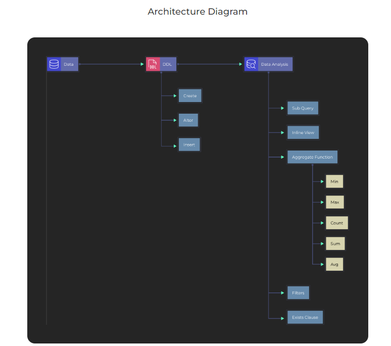

# SQL-Data-Analysis-Part-3
SQL Project for Data Analysis using Oracle Database-Part 3

### Project Description

### What is Dataset Analysis? 
Dataset Analysis is defined as manipulating or processing unstructured or raw data to draw valuable insights and conclusions that will help derive critical decisions that add some business value. The dataset analysis process is followed by organizing the dataset, transforming the dataset, visualizing the dataset, and finally modeling the dataset to derive predictions for solving the business problems, making informed decisions, and effectively planning for the future.

### Oracle SQL Developer :
Oracle SQL Developer is a free IDE that makes it easy to develop and operate Oracle Database in both traditional and cloud environments. SQL Developer is a complete end-to-end development of PL/SQL jobs, worksheets for running queries and scripts,  DBA  for database administration, reporting interfaces, and comprehensive data modeling output.

### What is the Agenda of the project? 
This is the third project in the SQL project series; the second project involved analyzing the data using SQL on the Oracle Database Software. Understanding different types of Joins(Inner join, Left outer join, Right outer join, Full outer join, Self join), different types of Operators(Minus, Union, Union all, Intersect). This project involves the data analysis using Sub-query, Group-by clause and Exists clause. It also consists of using inline view and aggregate functions(Min, Max, Count, Avg) to perform better analysis on data.

### Tech stack:  

● SQL Programming language

● Oracle SQL Developer

### Dataset Used

Hers is the DDL commands: [DDL.sql](https://github.com/Raghuraj-DataEngineer/SQL-Data-Analysis-Part-3/blob/main/DDL.sql)

Here is the Data Analysis queries:

[Data_Analysis.sql](https://github.com/Raghuraj-DataEngineer/SQL-Data-Analysis-Part-3/blob/main/Data_Analysis.sql)

### Key Takeaways

● Understanding the project and how to use Oracle SQL Developer

● Understanding the basics of data analysis, SQL commands, and their application

● Understanding the use of Oracle SQL Developer

● Understanding different types of aggregate functions(Min, Max, Count, Avg).

● Understanding different types of clauses.

● Data analysis using Sub-query.

● Understanding the background process of Sub-query.

● Understanding the inline view.

● Combine different aggregate results in a single row.

● Data analysis using Group-by clause.

● Data analysis using EXISTS clause.

● Filtering and organizing aggregated data

### Data Analysis:

● Data analysis using Sub-query.

● Inline view: List down all the employees along with department name and city where city is 'Roma'.

● Aggregate Function: Min, Max, Count, Sum, Avg.

● Combine different aggregated results in one row.

● Department wise data analysis.

● Filter and organize aggregated data.

● Show department level details using aggregate function and inline view.

● Data analysis using Sub-query and EXISTS clause.

